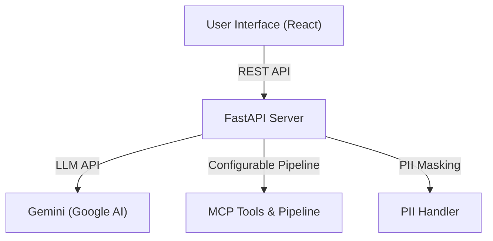

# Agentic AI Platform

A robust, enterprise-ready agentic AI platform featuring secure, configurable LLM workflows and a modern, user-friendly interface inspired by Anthropic’s Claude Desktop.

---

## Project Structure

- `backend/` – FastAPI backend (API, Gemini LLM integration, MCP server, PII handling)
- `frontend/` – React frontend (modern UI, chat, tools, health checks)

---

## Architecture



---

## Quick Start

1. **Clone the repository:**

   ```sh
   git clone <your-repo-url>
   cd agentic-ai
   ```

2. **See** [`backend/README.md`](backend/README.md) **for backend setup**
3. **See** [`frontend/README.md`](frontend/README.md) **for frontend setup**

---

## Features

- Gemini LLM integration (configurable)
- Secure, session-based PII masking/restoration
- Config-driven MCP pipeline (pre/post-processing, tools)
- Modern React UI with chat, model selection, and tool sidebar
- Health checks, error handling, and extensible architecture

---

## License

MIT
